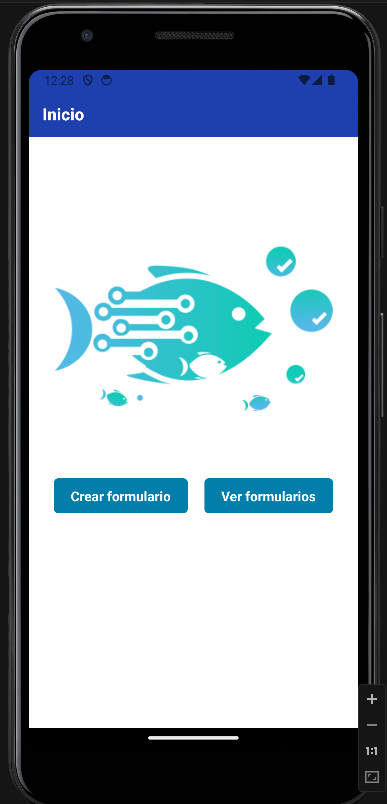
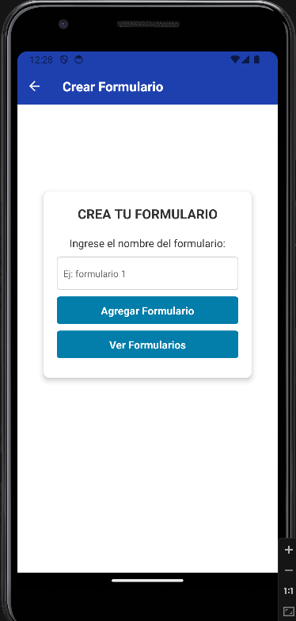
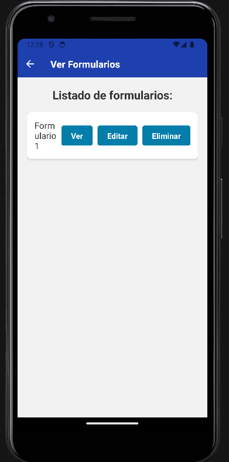
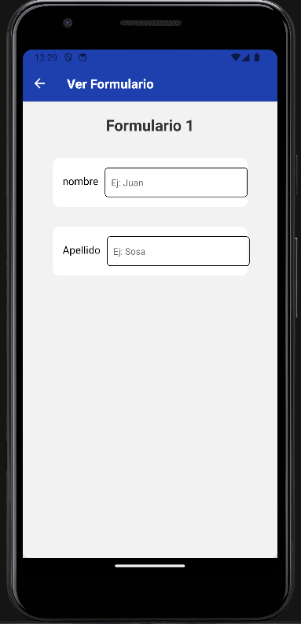
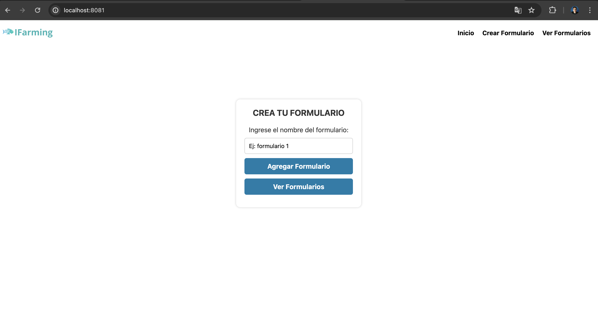
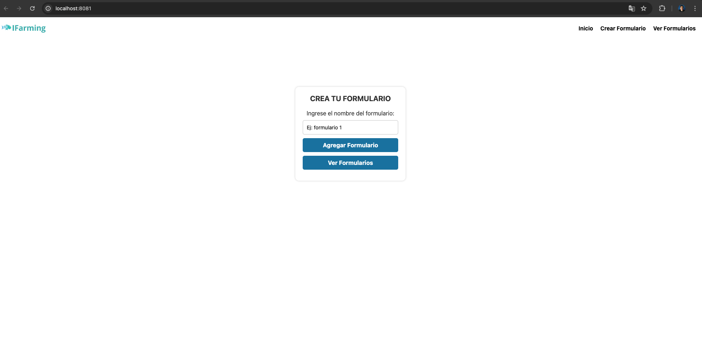
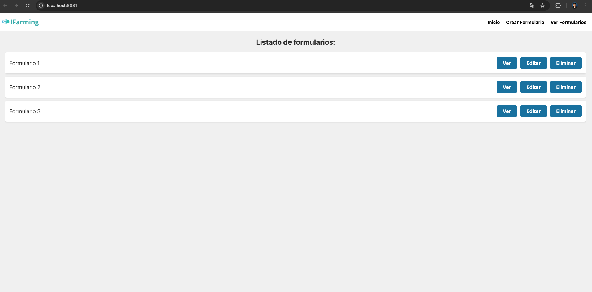
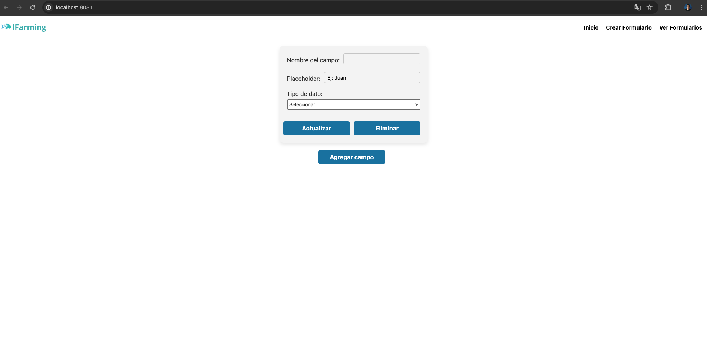

# IFarming App
 
_Este proyecto contiene una apilación Web y Movil, la cual, se realizo utilizando Expo, React Native y CSS_
_Debera tener en cuenta que se realizó una versión web y una version movil_

## Comenzando 🚀

_Estas instrucciones te permitirán obtener una copia del proyecto en funcionamiento en tu máquina local para propósitos de desarrollo y pruebas_

### Instalación 🔧

_1° debera clonar el repositorio en su computadora._

_2° debera ingresar a la carpeta raiz y ejecutar el siguiente comando:_

```
npm install
```

## Ejecutando ⚙️

_Para ejecutar el proyecto debera tener en cuenta si lo quiere ejecutar en web o movil:_

_Web:_

```
npx expo start
w
```

_Android:_

```
npx expo start
a
```
## Imagenes Android

|    |    |    |
|:----------------------------:|:----------------------------:|:----------------------------:|
| Imagen 1                     | Imagen 2                     | Imagen 3                     |

|    |    |
|:----------------------------:|:----------------------------:|
| Imagen 4                     | Imagen 5                     |

## Imagenes Web

|    |    |    |
|:--------------------------:|:---------------------------:|:--------------------------:|
| Imagen 1                   | Imagen 2                    | Imagen 3                   |

|    |    |
|:--------------------------:|:--------------------------:|
| Imagen 4                   | Imagen 5                   |


## Construido con 🛠️

* [React-Native](https://reactnative.dev/) - El framework web usado
* [Nativewind](https://www.nativewind.dev/) - Usado para los estilos
* [CSS](https://developer.mozilla.org/es/docs/Web/CSS) - Usado para los estilos


## Autores ✒️

* **Sosa Juan Segundo** - *Trabajo Inicial* - [juanse1998](https://github.com/Juanse1998)

